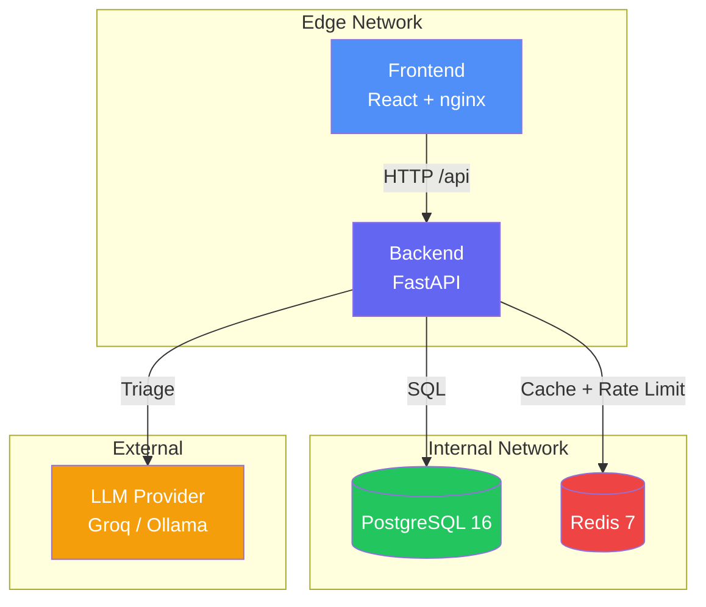

# CivicPulse 🏛

> Municipal Complaint Intake, Triage and Operations Platform

[](https://github.com/YOUR_ORG/civicpulse/actions/workflows/ci.yml)
[](https://github.com/YOUR_ORG/civicpulse/actions/workflows/cd.yml)

## Problem Statement

Every municipality runs the same broken process: citizen complaints land in an undifferentiated queue. CivicPulse fixes this by using AI to automatically triage complaints into categories and priorities, surfacing urgent issues immediately on an operations dashboard.

## Architecture



## Quickstart

```bash
# 1. Clone
git clone https://github.com/YOUR_ORG/civicpulse.git
cd civicpulse

# 2. Setup environment
cp .env.example .env

# 3. Start everything (one command)
docker compose up -d --build

# 4. Run migrations and seed data
docker compose exec backend alembic upgrade head
docker compose exec backend python -m app.seed

# 5. Open the app
# Frontend: http://localhost:80
# Backend API: http://localhost:8000/docs
```

## API Contract

| Method | Path | Behavior |
|--------|------|----------|
| `POST` | `/api/complaints` | Validate → triage → persist. 201/400/429 |
| `GET` | `/api/complaints/{id}` | 200/404 |
| `GET` | `/api/complaints` | Filter by category, priority, status; paginate |
| `PATCH` | `/api/complaints/{id}/status` | Enforce state machine. 409 on invalid transition |
| `GET` | `/api/stats` | Aggregates, Redis-cached, X-Cache header |
| `GET` | `/api/meta/providers` | Active provider + last 20 triage outcomes |
| `GET` | `/health` | Liveness (no DB) |
| `GET` | `/ready` | Readiness (checks Postgres + Redis) |
| `GET` | `/metrics` | Prometheus format |

## Technology Stack

- **Frontend**: React 18 + Vite + TypeScript, served by nginx:1.27-alpine
- **Backend**: FastAPI + Pydantic v2 + SQLAlchemy (async)
- **Database**: PostgreSQL 16 with Alembic migrations
- **Cache**: Redis 7 (stats cache + distributed rate limiter)
- **AI**: Groq (production), Ollama (offline), Rule-based (fallback), Simulated (CI)
- **Container**: Docker multi-stage builds, Docker Compose with network segmentation
- **Orchestration**: Kubernetes (Kustomize), HPA, VPA, PDB
- **CI/CD**: GitHub Actions (ci.yml, cd.yml, release.yml)

## Network Segmentation

```
┌─────────────────────────────┐
│ edge network                │
│  frontend ←→ backend        │
└─────────────────────────────┘
         │ (backend bridges both)
┌─────────────────────────────┐
│ internal network (no egress)│
│  backend ←→ database        │
│  backend ←→ cache           │
└─────────────────────────────┘
```

The frontend **cannot** reach the database:
```bash
docker compose exec frontend ping database  # FAILS — by design
```

## Testing

```bash
# Backend tests (deterministic, simulated provider)
cd backend && pip install -e ".[dev]"
TRIAGE_PROVIDER=simulated pytest --cov=app -v

# Frontend tests
cd frontend && npm ci && npm test
```

## Documentation

- [ADR 001: Provider Interface](docs/adr/0001-provider-interface.md)
- [ADR 002: Frontend Runtime Config](docs/adr/0002-frontend-runtime-config.md)
- [ADR 003: Deploy by SHA](docs/adr/0003-deploy-by-sha.md)
- [ADR 004: PII and Data Governance](docs/adr/0004-pii-and-data-governance.md)
- [Engineering Notes](docs/ENGINEERING-NOTES.md)
- [Runbook](docs/RUNBOOK.md)
- [AI Usage](docs/AI-USAGE.md)

## License

MIT
